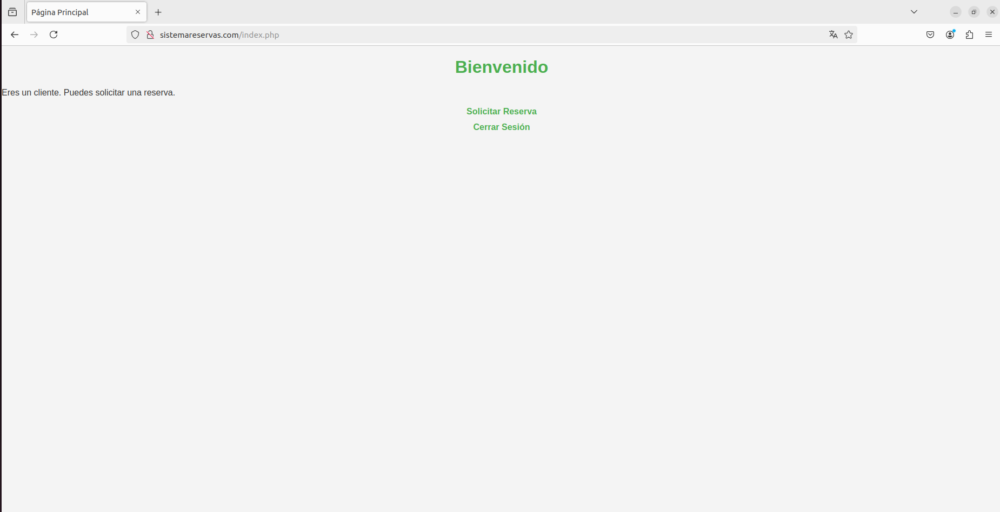
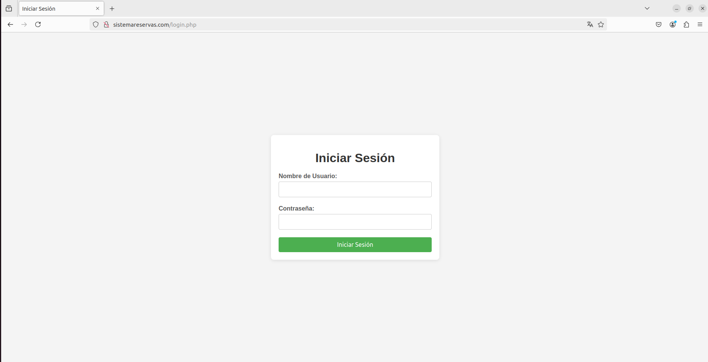
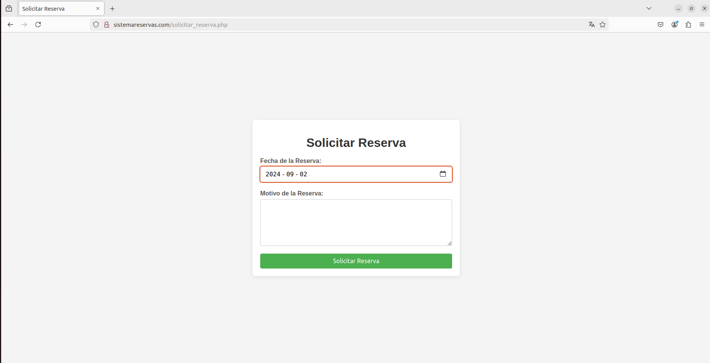
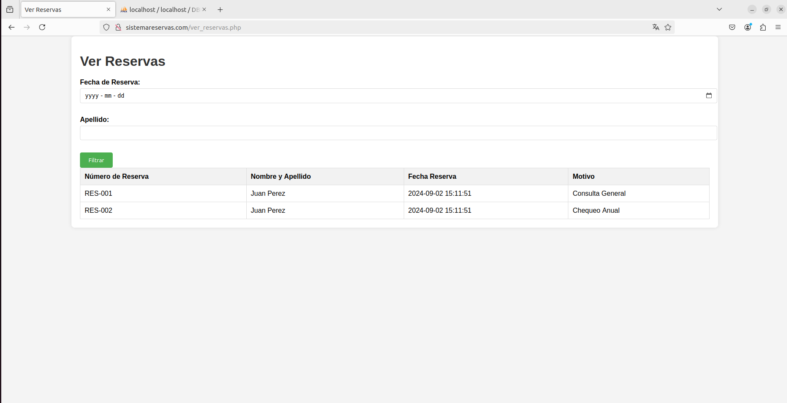

# Documentación del Sistema de Gestión de Reservas de Turnos

## Introducción

El Sistema de Gestión de Reservas de Turnos es una aplicación web de práctica diseñada con las herramientas LAMP (Linux, Apache2, MariaDB y PHP8.0) para gestionar la solicitud y seguimiento de reservas en establecimientos de finalidad X. El sistema permite a los clientes realizar una reserva, y a los empleados revisarlas, y proporciona un historial de modificaciones de usuarios y reservas accesible con un usuario tipo admin.

## Funcionalidad del Sistema

### Acceso de Usuarios

- **Usuarios**: Pueden crear nuevas reservas y consultar el estado de sus reservas.
- **Empleados**: Pueden revisar todas las reservas realizadas en el sistema.
- **Admin**: Pueden revisar todas las modificaciones realizadas en el sistema.

### Gestión de Reservas

- **Solicitud de Reserva**: Los clientes pueden solicitar reservas indicando la fecha y el motivo. La reserva se almacena en la base de datos y se asocia al usuario y al establecimiento seleccionado.
- **Historial de Reservas**: Se mantiene un historial de las reservas para cada usuario y establecimiento.

### Historial de Modificaciones

- **Usuarios**: Se registra cualquier cambio en la información del usuario (como cambio de correo electrónico o contraseña).
- **Reservas**: Se registra cualquier cambio en la información de las reservas (como cambio de fecha o estado).

## Seguridad

- **Autenticación y Autorización**: Solo los usuarios autenticados con el tipo adecuado pueden acceder a ciertas funcionalidades. Los clientes pueden crear reservas, mientras que los empleados tienen permisos para revisar todas las reservas.
- **Validación de Datos**: Se utilizan funciones para validar datos ingresados por el usuario para prevenir ataques como XSS desde un enfoque de backend.


## Estructura del Proyecto

El proyecto está compuesto por varios archivos PHP que gestionan las diferentes funcionalidades del sistema. También se han añadido funcionalidades de estilo y filtrado, y se ha configurado el envío de correos electrónicos para notificar sobre las reservas realizadas.

Archivos PHP y Funcionalidades

### 1. `index.php`

**Funcionalidad:**
- Muestra la página principal después del inicio de sesión.
- Dependiendo del tipo de usuario, muestra opciones específicas (admin, cliente, empleado).

**Código:**

```php
<?php
session_start();

if (!isset($_SESSION['id_usuario'])) {
    header("Location: login.php");
    exit();
}

// Verificar si 'tipo_usuario' está definido en la sesión
if (isset($_SESSION['tipo_usuario'])) {
    $tipo_usuario = $_SESSION['tipo_usuario'];
} else {
    // Manejo del error cuando 'tipo_usuario' no está definido
    $tipo_usuario = null; // O puedes establecer un valor predeterminado o redirigir al usuario
    $error = "Error: Tipo de usuario no definido. Por favor, inicie sesión nuevamente.";
}
?>

<!DOCTYPE html>
<html lang="es">
<head>
    <meta charset="UTF-8">
    <meta name="viewport" content="width=device-width, initial-scale=1.0">
    <title>Página Principal</title>
    <link rel="stylesheet" href="index.css">
</head>
<body>
    <h1>Bienvenido</h1>

    <?php
    // Mostrar el mensaje de éxito si existe
    if (isset($_SESSION['mensaje_exito'])) {
        echo "<p class='mensaje-exito'>" . $_SESSION['mensaje_exito'] . "</p>";
        unset($_SESSION['mensaje_exito']);
    }

    // Mostrar el mensaje de error si existe
    if (isset($error)) {
        echo "<p class='error'>$error</p>";
    }
    ?>

    <?php if ($tipo_usuario == 'admin'): ?>
        <p>Eres un administrador. Puedes realizar cualquier acción.</p>
    <?php elseif ($tipo_usuario == 'cliente'): ?>
        <p>Eres un cliente. Puedes solicitar una reserva.</p>
        <a href="solicitar_reserva.php">Solicitar Reserva</a>
    <?php elseif ($tipo_usuario == 'empleado'): ?>
        <p>Eres un empleado. Puedes revisar todas las reservas.</p>
        <a href="ver_reservas.php">Ver Reservas</a>
    <?php else: ?>
        <p>No se ha podido determinar el tipo de usuario. Por favor, inicie sesión nuevamente.</p>
    <?php endif; ?>
    
    <a href="logout.php">Cerrar Sesión</a>
</body>
</html>
```


### 2. `login.php`

**Funcionalidad:**
- Permite a los usuarios ingresar su nombre de usuario y contraseña.
- Verifica las credenciales y establece las variables de sesión.
- Redirige a la página principal después de un inicio de sesión exitoso.

**Código:**

```php
<?php
session_start();
include 'conexion.php';

if ($_SERVER["REQUEST_METHOD"] == "POST") {
    $username = $_POST['username'];
    $passwd = $_POST['passwd'];

    try {
        $usuario = verificarLogin($conn, $username, $passwd);

        // Si se logra la autenticación, se establecen las variables de sesión
        $_SESSION['id_usuario'] = $usuario['id_usuario'];
        $_SESSION['tipo_usuario'] = $usuario['tipo_usuario'];
        header("Location: index.php");
        exit();

    } catch (Exception $e) {
        // Capturar la excepción y mostrar un mensaje de error al usuario
        $error = "Error de autenticación: " . $e->getMessage();
    }
}
?>

<!DOCTYPE html>
<html lang="es">
<head>
    <meta charset="UTF-8">
    <meta name="viewport" content="width=device-width, initial-scale=1.0">
    <title>Iniciar Sesión</title>
    <link rel="stylesheet" href="login.css">
</head>
<body>
    <div class="container">
        <h1>Iniciar Sesión</h1>
        <form method="post">
            <label for="nombre_usuario">Nombre de Usuario:</label>
            <input type="text" id="nombre_usuario" name="username" required>

            <label for="contrasenia">Contraseña:</label>
            <input type="password" id="contrasenia" name="passwd" required>

            <input type="submit" value="Iniciar Sesión">
        </form>

        <?php if (isset($error)) echo "<p>$error</p>"; ?>
    </div>
</body>
</html>
```


### 3. `solicitar_reserva.php`

**Funcionalidad:**
- Permite a los clientes solicitar una reserva.
- Procesa el formulario y guarda la reserva en la base de datos.
- Envía un correo electrónico de confirmación.

**Código:**

```php
<?php
include 'conexion.php';
session_start();

// Verificar si el usuario es cliente
if ($_SESSION['tipo_usuario'] != 'cliente') {
    header("Location: index.php");
    exit();
}

// Procesar el formulario cuando se envía
if ($_SERVER["REQUEST_METHOD"] == "POST") {
    $id_usuario = $_SESSION['id_usuario'];
    $fecha_reserva = $_POST['fecha_reserva'];
    $motivo = htmlspecialchars($_POST['motivo']);

    // Preparar la consulta
    $consulta = $conn->prepare("INSERT INTO reserva (idUsuario, fechaReserva, motivo) VALUES (?, ?, ?)");

    if ($consulta === false) {
        die("Error al preparar la consulta: " . $conn->error);
    }

    // Vincular parámetros y ejecutar la consulta
    $consulta->bind_param("iss", $id_usuario, $fecha_reserva, $motivo);

    if ($consulta->execute()) {
        // Establecer un mensaje de éxito en la sesión
        $_SESSION['mensaje_exito'] = "Reserva solicitada con éxito.";

        // Obtener los detalles del usuario para la notificación
        $usuario_query = $conn->prepare("SELECT nombre, apellido, correoElectronico FROM usuario WHERE id = ?");
        $usuario_query->bind_param("i", $id_usuario);
        $usuario_query->execute();
        $usuario_result = $usuario_query->get_result();
        $usuario = $usuario_result->fetch_assoc();

        // Enviar notificación por correo electrónico
        $to = $usuario['correoElectronico'];
        $subject = "Confirmación de Reserva";
        $message = "Hola " . htmlspecialchars($usuario['nombre']) . " " . htmlspecialchars($usuario['apellido']) . ",\n\n";
        $message .= "Tu reserva ha sido solicitada con éxito.\n\n";
        $message .= "Detalles de la reserva:\n";
        $message .= "Fecha de Reserva: " . htmlspecialchars($fecha_reserva) . "\n";
        $message .= "Motivo: " . htmlspecialchars($motivo) . "\n\n";
        $message .= "Gracias,\nEl equipo de reservas";
        $headers = "From: no-reply@sistemareserva.com";

        if (mail($to, $subject, $message, $headers)) {
            // Redirigir a la página principal
            header("Location: index.php");
            exit();
        } else {
            echo "Error al enviar la notificación por correo electrónico.";
            header("Location: index.php");
            exit();
        }

        // Cerrar la consulta de usuario
        $usuario_query->close();
    } else {
        echo "Error: " . $consulta->error;
    }

    // Cerrar la consulta
    $consulta->close();
}

// Cerrar la conexión
$conn->close();
?>

<!DOCTYPE html>
<html lang="es">
<head>
    <meta charset="UTF-8">
    <meta name="viewport" content="width=device-width, initial-scale=1.0">
    <title>Solicitar Reserva</title>
    <link rel="stylesheet" href="solicitar_reserva.css">
</head>
<body>
    <div class="container">
        <h1>Solicitar Reserva</h1>
        <form method="post">
            <label for="fecha_reserva">Fecha de la Reserva:</label><br>
            <input type="date" id="fecha_reserva" name="fecha_reserva" required><br><br>

            <label for="motivo">Motivo de la Reserva:</label><br>
            <textarea id="motivo" name="motivo" required></textarea><br><br>

            <input type="submit" value="Solicitar Reserva">
        </form>
    </div>
</body>
</html>
```



### 4. `solicitar_reserva.php`

**Funcionalidad:**
- Permite a los empleados ver todas las reservas.
- Incluye funcionalidad de filtrado por fecha y apellido del usuario.

**Código:**

```php
<?php
include 'conexion.php';
session_start();

// Verificar si el usuario es empleado
if ($_SESSION['tipo_usuario'] != 'empleado') {
    header("Location: index.php");
    exit();
}

// Inicializar variables de filtro
$fecha_reserva = isset($_POST['fecha_reserva']) ? $_POST['fecha_reserva'] : '';
$nombre_apellido = isset($_POST['nombre_apellido']) ? $_POST['nombre_apellido'] : '';

// Preparar la consulta con filtros
$sql = "SELECT r.nroReserva, u.nombre, u.apellido, r.fechaReserva, r.motivo
        FROM reserva r
        JOIN usuario u ON r.idUsuario = u.id
        WHERE 1=1";

if (!empty($fecha_reserva)) {
    $sql .= " AND r.fechaReserva = ?";
}

if (!empty($nombre_apellido)) {
    $sql .= " AND (u.nombre LIKE ? OR u.apellido LIKE ?)";
}

$consulta = $conn->prepare($sql);

if ($consulta === false) {
    die("Error al preparar la consulta: " . $conn->error);
}

// Vincular parámetros si hay filtros
$params = [];
$types = '';

if (!empty($fecha_reserva)) {
    $params[] = $fecha_reserva;
    $types .= 's';  // Tipo de dato string
}

if (!empty($nombre_apellido)) {
    $params[] = "%$nombre_apellido%";
    $params[] = "%$nombre_apellido%";
    $types .= 'ss';  // Tipo de dato string para dos parámetros
}

if (!empty($params)) {
    $consulta->bind_param($types, ...$params);
}

$resultado = $consulta->execute();

if ($resultado === false) {
    die("Error al ejecutar la consulta: " . $consulta->error);
}

// Obtener los resultados
$resultados = $consulta->get_result();

if ($resultados === false) {
    die("Error al obtener los resultados: " . $conn->error);
}
?>

<!DOCTYPE html>
<html lang="es">
<head>
    <meta charset="UTF-8">
    <meta name="viewport" content="width=device-width, initial-scale=1.0">
    <title>Ver Reservas</title>
    <link rel="stylesheet" href="ver_reservas.css">
</head>
<body>
    <div class="container">
        <h1>Ver Reservas</h1>
        <form method="post">
            <label for="fecha_reserva">Fecha de Reserva:</label>
            <input type="date" id="fecha_reserva" name="fecha_reserva" value="<?php echo htmlspecialchars($fecha_reserva); ?>"><br><br>
            
            <label for="nombre_apellido">Apellido:</label>
            <input type="text" id="nombre_apellido" name="nombre_apellido" value="<?php echo htmlspecialchars($nombre_apellido); ?>"><br><br>
            
            <input type="submit" value="Filtrar">
        </form>
        <table>
            <thead>
                <tr>
                    <th>Número de Reserva</th>
                    <th>Nombre y Apellido</th>
                    <th>Fecha Reserva</th>
                    <th>Motivo</th>
                </tr>
            </thead>
            <tbody>
                <?php while ($fila = $resultados->fetch_assoc()): ?>
                    <tr>
                        <td><?php echo htmlspecialchars($fila['nroReserva']); ?></td>
                        <td><?php echo htmlspecialchars($fila['nombre']) . " " . htmlspecialchars($fila['apellido']); ?></td>
                        <td><?php echo htmlspecialchars($fila['fechaReserva']); ?></td>
                        <td><?php echo htmlspecialchars($fila['motivo']); ?></td>
                    </tr>
                <?php endwhile; ?>
            </tbody>
        </table>
    </div>
</body>
</html>

<?php
// Cerrar la consulta y la conexión
$consulta->close();
$conn->close();
?>
```

